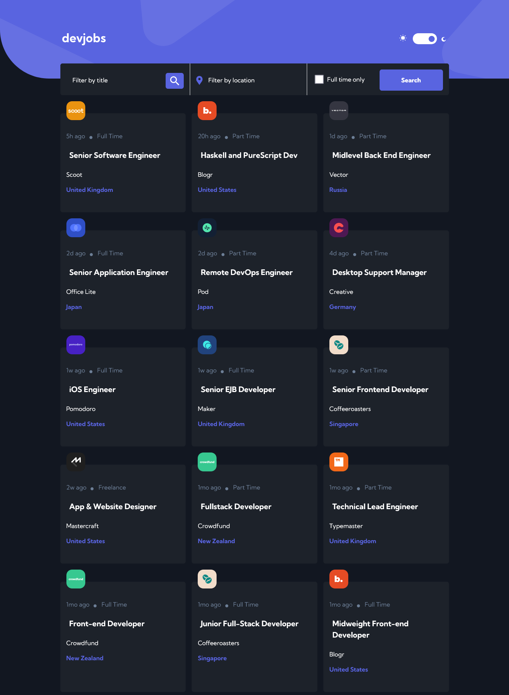

# Frontend Mentor - Devjobs web app solution

This is a solution to the [Devjobs web app challenge on Frontend Mentor](https://www.frontendmentor.io/challenges/devjobs-web-app-HuvC_LP4l). Frontend Mentor challenges help you improve your coding skills by building realistic projects.

## Table of contents

- [Overview](#overview)
  - [The challenge](#the-challenge)
  - [Screenshot](#screenshot)
  - [Links](#links)
- [My process](#my-process)
  - [Built with](#built-with)
  - [What I learned](#what-i-learned)
  - [Continued development](#continued-development)
  - [Useful resources](#useful-resources)
- [Author](#author)
- [Acknowledgments](#acknowledgments)

## Overview

### The challenge

Users should be able to:

- View the optimal layout for each page depending on their device's screen size
- See hover states for all interactive elements throughout the site
- Be able to filter jobs on the index page by title, location, and whether a job is for a full-time position
- Be able to click a job from the index page so that they can read more information and apply for the job
- **Bonus**: Have the correct color scheme chosen for them based on their computer preferences. _Hint_: Research `prefers-color-scheme` in CSS.

### Screenshot



Add a screenshot of your solution. The easiest way to do this is to use Firefox to view your project, right-click the page and select "Take a Screenshot". You can choose either a full-height screenshot or a cropped one based on how long the page is. If it's very long, it might be best to crop it.

Alternatively, you can use a tool like [FireShot](https://getfireshot.com/) to take the screenshot. FireShot has a free option, so you don't need to purchase it.

Then crop/optimize/edit your image however you like, add it to your project, and update the file path in the image above.

### Links

- Solution URL: [Add solution URL here](https://your-solution-url.com)
- [Live Site URL:](https://devjobs-web-app.netlify.app/)

## My process

### Built with

- Semantic HTML5 markup
- Javascript
- Context Api
- CSS Grid
- Sass - mixins
- Mobile-first workflow
- created using `create-react-app` [React](https://reactjs.org/) - JS library

### Installation

The project can be installed by using the guidelines below

- select code on this page on github
- select https on the modal that opens and copy the link below that
- open the folder where you want to clone the project
- open a terminal and type `git clone` and paste the link copied above and press enter
- when files and folders has been copied run `npm install` at the root of the project to install dependencies used in the project

### What I learned

1. Getting data from a local json file [Fetch Data from a JSON File in a React App](https://app.pluralsight.com/guides/fetch-data-from-a-json-file-in-a-react-app).
Place the json file and the assets in the public folder. Your Fetch API calls made from a React component always looks for files or any other relevant assets inside this public directory. Create-React-App doesn't put your assets automatically inside this directory during compilation so you have to do this manually. Method to fetch the data is shown below - just another api call. Pay attention to the fetch api call. The path to your JSON file should be either 'data.json' or './data.json'. Other relative paths might land you a 404 error while trying to access that resource. You also need to pass in some headers indicating the Content-Type and Accept as application/json to tell your client that you are trying to access and accept some JSON resource from a server.

```javascript
const getData=()=>{
    fetch('data.json'
    ,{
      headers : { 
        'Content-Type': 'application/json',
        'Accept': 'application/json'
       }
    }
    )
      .then(function(response){
        console.log(response)
        return response.json();
      })
      .then(function(myJson) {
        console.log(myJson);
      });
  }
  useEffect(()=>{
    getData()
  },[])

  ```

2.How to build a floating label input field [How to build a floating label input field](https://itnext.io/how-to-build-a-floating-label-input-field-f9b21669fe2f)

3.Toggle switch design [On Designing and Building Toggle Switches](https://www.sarasoueidan.com/blog/toggle-switch-design/)

4.Theme Switcher [A Theme Switcher](https://inclusive-components.design/a-theme-switcher/)

5.Passing data to sibling pages/components using Context Api video [React State Management Tutorial | Context Api | React Tutorial For Beginners](https://www.youtube.com/watch?v=35lXWvCuM8o)

- Share data among components to avoid props drilling - lifting up the state
Two items will be exported.

- 1. create a context component that holds the data (JobsContext, ThemeContext)

- 2. place the data to be shared in the context components

- 3. create a context provider in the context file `export const ThemeProvider`

- 4. import `{useState and createContext}` from react

- 5. to initiate the context `export const ThemeContext = createContext()`

- 6. rendering the provider and the context

 ```js
return (
        <ThemeContext.Provider value={{ theme, onChange }}>
            {props.children}
        </ThemeContext.Provider>
    )
    ```

- consuming the context and provider `import { ThemeProvider } from './Context/ThemeContext';`

```js
<ThemeProvider>
      <div className={`app__container`}>
        <Router>

          <Header />
          <Switch>
            <JobsProvider>
              <Route exact path="/">
                <HomePage />
              </Route>
              <Route path="/:id">
                <ListPage />
              </Route>
            </JobsProvider>
          </Switch>

        </Router>
      </div>
    </ThemeProvider>

```

- 7. passing (using) the values to the children `import { useContext } from 'react'`

- 8. `import { ThemeContext } from '../Context/ThemeContext'`, import in component that needs the logic of the context.

- 9. destructure the data `const { theme, onChange } = useContext(ThemeContext)`

- 10. use the destructured in your component

### Continued development

- implementing the load more feature. infinite scrolling

### Useful resources

- the useful resources that helped me in this project has been listed in the - [What i learned section]

## Author

- Website - [Chamu Mutezva](https://github.com/ChamuMutezva)
- Frontend Mentor - [@ChamuMutezva](https://www.frontendmentor.io/profile/ChamuMutezva)
- Twitter - [@ChamuMutezva](https://twitter.com/ChamuMutezva)

## Acknowledgments